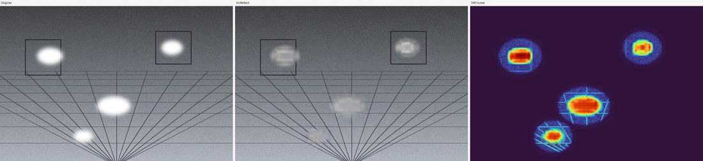

# ReflectMask for RealityScan（日本語）

[](https://github.com/toruhashimoto/unreflectanything-batch/actions/workflows/ci.yml)
[](LICENSE)
[](https://github.com/alberto-rota/UnReflectAnything)
[](https://www.realityscan.com/)

[English](README.md) · **日本語**

> **RealityScan 向けのマスク優先ワークフローです。**（リポジトリ／Python パッケージ名は
> `unreflectanything-batch` のまま）**ReflectMask** は、鏡面反射・白飛びハイライトを特徴抽出から
> 除外する**タイトな二値アライメントマスク**を生成し、RealityScan が有効な特徴点を保持して
> **高詳細フォトグラメトリ**でより安定してアライメントできるよう支援します。
> [UnReflectAnything](https://github.com/alberto-rota/UnReflectAnything) は**反射検出の backend**
> としてのみ使用します（本家とは無関係・非公認、コードは一切同梱せず PyPI 経由で公開 API を呼ぶだけ）。

**目的は「写真をきれいに見せること」ではありません。** 鏡面反射や白飛びが生む**不安定で視点依存な
特徴点を除外**しつつ、**有効な特徴点をできるだけ多く保持**することで、RealityScan の再構成をより
高詳細・安定にすることが目的です。

**推奨出力 = 元画像 + 各写真 1 枚の タイトな `‹名前›.mask.png`**（白＝採用、黒＝除外する反射）。
元画像は**決して改変せず** RealityScan への主入力のまま。アライメント時に不安定な反射画素だけを無視します。
反射を*除去した*クリーン画像出力も残していますが、**experimental／diagnostic 扱い**に降格しました。

### モード
| モード | 出力 | 用途 |
|---|---|---|
| **`reflectmask`**（既定） | 元画像コピー + `‹名前›.mask.png` 除外マスク | **推奨：RealityScan アライメントマスク生成** |
| **`diagnostic`** | マスク **＋** before/after プレビュー・差分ヒートマップ | backend が何を拾うかの検証用 |
| **`clean`**（実験的） | 反射除去（クリーン化）画像 | A/B 比較専用——多くの場合アライメントには不利 |

> ⚠️ **広く消すのではなく、タイトに。** マスクを広げすぎると明るい*拡散面*（空・白い塗装/車体）まで
> 除外し、特徴の宝庫を潰してアライメントを分裂させます。ゲートはタイトに——実行時に平均除外率を表示し、
> **5%（warning）／12%（danger）**で警告します。大きなマスクが必要な素材は、**マスク無しの元画像**が
> 最良のことが多いです。必ず A/B 比較を。

---

## デモ



*合成シーン（鏡面グレアあり）→ `--mask-composite` → 差分ヒートマップ。元画像は変更されず、白飛び領域
だけが変化し、ヒートマップが変化箇所を正確に示します。詳細・再現方法は [`examples/`](examples/) を参照。*

---

## 1. 動作要件

| | |
|---|---|
| OS | Windows 10/11（Windows 11 で検証） |
| Python | **3.11+**（3.11 で検証） |
| GPU（任意） | NVIDIA CUDA GPU。**RTX 50 系（Blackwell/sm_120）で検証**（RTX 5070 Ti）。CPU でも動作可（低速）。 |
| ディスク | 約 3 GB（PyTorch）＋ **約 5.9 GB（モデル重み）**＋ 画像 |

GPU が無くても自動で CPU にフォールバックします（低速）。

---

## 2. セットアップ

### 最も簡単：起動スクリプトに任せる
**`run_app.bat`**（GUI）または **`run_batch_example.bat`**（CLI）をダブルクリック。初回は仮想環境作成・
依存導入・重みダウンロードまで自動で行います。

### セットアップスクリプトを直接実行
```powershell
powershell -ExecutionPolicy Bypass -File scripts\setup_env.ps1 -Gui
```
`-Gui` で Streamlit も導入。`-SkipWeights` で 5.9 GB のダウンロードを後回し、
`-CudaIndex https://download.pytorch.org/whl/cu130` で新しいドライバ向けに変更可。

### 手動（2 つの落とし穴を理解する）
```powershell
# 1) 仮想環境を作成
py -3.11 -m venv .venv
.\.venv\Scripts\Activate.ps1
python -m pip install -U pip

# 2) 落とし穴#1 — CUDA 版 PyTorch を「先に」PyTorch インデックスから入れる。
#    Windows の既定 PyPI torch は CPU 専用で、Blackwell(sm_120) には cu128 ビルドが必要。
pip install torch==2.9.1 torchvision==0.24.1 --index-url https://download.pytorch.org/whl/cu128

# 3) 落とし穴#2 — requirements.txt は transformers を「特定コミット」に固定。
#    素の `pip install unreflectanything` は最新 transformers を入れてしまい、DINOv3 のキーが
#    合わず推論が「Error(s) in loading state_dict ... Missing key(s) ... dinov3」で失敗する。
pip install -r requirements.txt
```

### GPU 確認（任意）
```powershell
.\.venv\Scripts\python.exe -c "import torch; print(torch.__version__, torch.cuda.is_available(), 'sm_120' in torch.cuda.get_arch_list())"
# 期待:  2.9.1+cu128 True True
```

---

## 3. モデル重みのダウンロード（初回のみ・必須）

**自動ダウンロードはありません**。一度だけ取得してください（約 5.9 GB）：
```powershell
.\.venv\Scripts\unreflectanything.exe download --weights
.\.venv\Scripts\unreflectanything.exe verify --weights   # 任意：読み込み確認
```
重みは `%LOCALAPPDATA%\unreflectanything\weights` にキャッシュされ、毎回再利用されます。

ツールから取得させることもできます：`main.py` に **`--download-weights`** を付ける、または GUI サイドバーの
**「Download model weights」**ボタン。重み未取得時は、**実行途中で落ちず**に、コマンドとキャッシュ場所を
示す分かりやすいメッセージで即座に停止します。

---

## 4. 使い方 — GUI
```powershell
run_app.bat
```
**モード**（既定 **ReflectMask**）を選び、入力・出力フォルダを設定し、サイドバーで RealityScan
マスク設定を調整して **Run**。進捗・平均除外率（過剰マスク警告つき）・RealityScan 取り込み手順・
サンプルマスクが表示されます。GUI は CLI と同じエンジンを呼びます。

## 5. 使い方 — CLI

先頭の任意サブコマンドでモードを選択（既定 = `reflectmask`）。

### ReflectMask — RealityScan アライメントマスク生成（メイン機能）
```powershell
python main.py reflectmask --input "D:\photo_input" --output "D:\rs_reflectmask" --recursive --device cuda
```
`‹output›\realityscan\` に、各元画像のバイト完全コピー + `‹名前›.mask.png` を出力し、そのまま
RealityScan へ取り込めます。**クリーン画像は出力しません。** 旧来のフラット形式
（`python main.py -i ... -o ...`、サブコマンド無し）も ReflectMask として動作し、旧 `--realityscan`
フラグも引き続き受理します。

**GPU/重みが無い場合は** `--backend luma` を付けると、モデル不要の純輝度マスクになります
（`--rs-gate` が輝度しきい値。高め＝タイトに保つ）。出力フォルダ構成は同じで、A/B のベースラインにも便利です。

### Diagnostic プレビュー / Cleaned 出力（実験的）
```powershell
python main.py diagnostic --input "D:\in" --output "D:\out" --recursive   # マスク + プレビュー + ヒートマップ
python main.py clean      --input "D:\in" --output "D:\out" --recursive   # 実験的：クリーン化画像
```

主なオプション（全モード共通）：

| フラグ | 既定 | 説明 |
|---|---|---|
| `--input, -i` | — | 入力フォルダ（**必須**） |
| `--output, -o` | — | 出力フォルダ（**入力の外**であること。**必須**） |
| `--recursive, -r` | off | サブフォルダを再帰処理（構成を出力に反映） |
| `--device, -d` | `auto` | `auto` / `cuda` / `cpu`（auto は動作可能な GPU があれば使用） |
| `--backend` | `unreflect` | 反射検出バックエンド：`unreflect`（AI・GPU+重み必要）/ `luma`（純輝度ゲート・モデル/GPU/重み不要、`--rs-gate` が輝度しきい値） |
| `--extensions` | `.jpg,.jpeg,.png,.tif,.tiff` | 対象拡張子（カンマ区切り） |
| `--make-preview` | off | before/after 横並びを `preview_compare/` に保存 |
| `--heatmap` | off | 輝度差ヒートマップを `heatmap/` に保存 |
| `--emit-mask` | off | 変更領域マスクを `masks/` に保存（COLMAP の除外マスク用） |
| `--composite` | off | モデル内部 composite（約 448px で合成、全体はソフト化されたまま） |
| `--mask-composite` | off | **ラッパーのフル解像度 composite**：白飛び以外は原寸のまま保持（**高解像度の SfM/3DGS 入力に最適**） |
| `--mask-level` | `248` | mask-composite：この輝度(0-255)より明るい画素のみ置換（高いほどタイト＝ボケにくい） |
| `--mask-dilation` | `0` | mask-composite：置換領域を N px 膨張（小さく保つ。大きいと主役がボケる） |
| `--realityscan` | off | **RealityScan 用アライメントマスクを出力**：各*元画像*のコピー＋`‹名前›.mask.png` 除外マスク（黒＝モデルが除去した反射＝除外、白＝採用）を `realityscan/` に。→ [RealityScan マスク](#7b-realityscan-用アライメントマスク) |
| `--rs-gate` | `250` | RealityScan マスク：*元画像*の輝度が この値以上 の画素のみ対象（0-255、0 で無効）。既定はタイトで、空・白い塗装/車体など拡散面の明るさを除外しない。グレアが強い素材は ~240 に下げる |
| `--rs-drop` | `12` | RealityScan マスク：反射とみなす最小の輝度低下量（モデルが暗くした量） |
| `--rs-dilation` | `2` | RealityScan マスク：除外領域を N px 膨張（反射のにじみを覆う。小さく保つ） |
| `--rs-open` | `1` | RealityScan マスク：この半径より小さい孤立点を除去（モルフォロジー open） |
| `--rs-masks-only` | off | RealityScan：`.mask.png` のみ出力（元画像をコピーしない）。このフォルダは**そのままでは取り込み不可**——各マスクを写真と同じフォルダに統合してから取り込むこと |
| `--rs-separator` | `.` | RealityScan マスク名の `mask` 直前の区切り（`. _ @ # !` のいずれか） |
| `--mask-warn` | `5.0` | マスク平均除外率がこの値を超えたら warning |
| `--mask-danger` | `12.0` | マスク平均除外率がこの値を超えたら danger（有効特徴の過剰マスクの疑い） |
| `--exiftool` | off | exiftool があれば全メタデータを複写（メーカーノート/GPS/XMP・全形式・低速） |
| `--verbose` | off | エンジン自身の出力を表示 |
| `--overwrite` | off | 既存出力を上書き（既定はスキップ） |
| `--jpeg-quality` | `95` | JPEG 品質（95 以上を強制、4:4:4） |
| `--threshold` | `0.3` | ハイライト検出閾値（モデル） |
| `--dilation` | `40` | ハイライトマスクの膨張(px)（モデル） |
| `--limit N` | — | **テストモード**：先頭 N 枚のみ処理 |
| `--max-size PX` | — | **簡易モード**：長辺を縮小して処理（⚠ 出力寸法が変わる＝COLMAP 入力には不可） |
| `--model-max-size PX` | `2048` | マスクモード：モデルの作業解像度を上限化（内部 ~448px なのでフル 50MP は無駄）。マスク・オリジナルコピーは**ネイティブ維持**＝RealityScan 成果物の解像度は不変、50MP で約4倍速。`0` でフル解像度。`clean` モードでは無効 |
| `--workers N` | `auto` | 並列ワーカープロセス数（`auto` / 整数、`1`=逐次）。1枚ごとの処理は CPU/I-O 律速で GPU はほぼ遊ぶため、多コア機ではこれが最大のレバー。`auto` はハードコードではなく実機の資源（CPU コア・空き VRAM・空き RAM）から自動算出。AI のモデルロードは**ずらして実行**（同時 ≤3）し、多数ワーカーでもディスク/CUDA の嵐を構造的に回避。実測: luma ~13倍、AI ~2.5倍。GUI は逐次 |
| `--download-weights` | off | 重みが無ければ約 5.9 GB を先に取得してから実行 |
| `--dry-run` | off | 処理内容を表示のみ（実行しない） |
| `--no-progress` | off | 進捗バーを無効化 |

### 単体処理（エンジンを直接）
```powershell
.\.venv\Scripts\unreflectanything.exe inference "in.jpg" -o "out.jpg" -d cuda
```

---

## 6. 出力構成
```
<output>/
├── <元のツリー・元のファイル名>            # クリーン化画像（形式/寸法/EXIF 維持）
├── preview_compare/                      # [Original | UnReflect | (Diff)] 横並び  (--make-preview)
├── heatmap/                              # 輝度差ヒートマップ                       (--heatmap)
├── masks/                                # 変更領域マスク                          (--emit-mask)
├── realityscan/                          # 元画像コピー＋‹名前›.mask.png            (reflectmask / diagnostic)
├── diagnostic/                           # 6 パネル検査シート                       (diagnostic モード)
└── logs/
    ├── process_log.jsonl                 # 画像ごとの詳細 JSON（1 行 1 件）
    ├── process_log.csv                   # フラットな集計表
    ├── errors.csv                        # 失敗画像のみ
    └── run_summary.json                  # 実行全体の集計＋設定
```
各レコードに `processed_by: "UnReflectAnything"`、元画像参照・日時・モデル名/版・デバイス・入出力サイズ・
処理時間・使用パラメータ・評価指標・エラー内容を記録します。

---

## 7. 評価機能
- **平均輝度差**（前→後）
- **ハイライト画素率**（前/後）— 白飛び除去の度合いの指標
- **差分ヒートマップ**（`--heatmap`）— どこをどれだけ変えたか
- **変更マスク**（`--emit-mask`）— *変更された*領域の二値マスク（255=変更箇所）。モデルが触れた箇所の簡易可視化。実際の特徴**除外マスク**（黒=除外）は [`--realityscan`](#7b-realityscan-用アライメントマスク) か `tools/make_colmap_masks.py` を使用（正しい極性・命名で出力）
- **テストモード**（`--limit N`）・**簡易モード**（`--max-size PX`）

---

## 7b. RealityScan 用アライメントマスク

反射を写真から*消す*代わりに、元画像はそのままにして、反射画素を特徴抽出から除外する**マスク**を
**RealityScan** に渡せます。アライメントではこちらが有利なことが多く、周囲の画素は記述子・幾何を
保ったまま、視点依存で不安定な反射だけを無視できます（→ [§9b](#9b-ab-評価パイプライン任意)）。

GUI（サイドバー → **RealityScan alignment masks**）または `--realityscan` で有効化：

```powershell
python main.py --input "D:\photo_input" --output "D:\photo_unreflect" --recursive --realityscan
```

`‹output›\realityscan\` に**そのまま取り込めるフォルダ**を出力します。各写真について、**元画像**の
バイト完全コピーとマスクが並びます：

```
realityscan\
├── IMG_1234.jpg                # 元画像のコピー（無改変。入力フォルダは不可侵）
└── IMG_1234.jpg.mask.png       # 8bit グレースケール。黒＝反射(除外)、白＝採用
```

マスクは**モデルが白飛びハイライトを除去した箇所**を示します（モデルが暗くした画素を、既定では
ほぼ白飛びの輝度でゲートするため、空・白い塗装・淡色の車体などの明るい*拡散*面は**除外されません**）。
出力は厳密な二値（0/255・ハードエッジ）で、写真の原寸です。

**RealityScan での読み込み**（RealityScan 2.x で確認。RealityCapture から不変 —
[公式ドキュメント](https://rshelp.capturingreality.com/en-US/tools/mask.htm)）：

1. **WORKFLOW → Inputs → Folder** で `‹output›\realityscan` を指定し、写真と**マスクを同時に**読み込む
   （名前で `.mask` レイヤーが自動付与。別々に取り込むとマスクが追加写真として扱われる）。
2. 画像を選択 → **Selected Input → Image Layers** → **「Enable masks for alignment」**にチェック
   （ステージ別の独立トグル。メッシュ/テクスチャ有効化では自動では入らない）。
3. アライメントを実行。

> 間違えやすいのが極性です。RealityScan は **白＝採用・黒＝除外**（*"In a mask, white areas will be used
> in processing, while black areas are excluded."*）。本ツールはこの極性で出力します（取り込み時の反転
> トグルはありません）。

調整：特徴を多く残すなら `--rs-gate` を上げる（例 `252`）、グレアが強い素材で反射を多く拾うなら下げる
（例 `240`）。`--rs-dilation` でにじみを覆えます。実行時に**平均除外率**を表示します。大きい（>~12%）
場合は拡散面を除外し過ぎており、その素材はマスク無しの**元画像**が最良の可能性が高いです。

**GPU/重みが無い場合：** `tools/make_realityscan_masks.py` が同じ取り込み用フォルダを、純粋な輝度しきい値
（モデル不要）で生成します：

```powershell
python tools\make_realityscan_masks.py -i "D:\photo_input" -o "D:\rs_project" --level 250 --dilation 2
```

---

## 8. COLMAP / 3DGS 互換性の保ち方
- **元画像は不可侵**。出力は別ツリー、同名は既定でスキップ。
- **寸法を維持**（COLMAP は EXIF と画像サイズから焦点距離(px)を導出するため、リサイズは intrinsics を壊す）。
- **EXIF を維持**（特に `FocalLengthIn35mmFilm`/`FocalLength`。JPEG→JPEG は完全移植、TIFF/PNG はベストエフォート）＋ICC。
- **形式を維持**（JPEG→JPEG は品質≥95・4:4:4・単一エンコード、PNG/TIFF はロスレス）。二重 JPEG なし。
- **全集合を同一設定で均一処理**（視点間の輝度不連続を回避）。

---

## 9. 推奨ワークフロー（3DGS / フォトグラメトリ）
1. **撮影時の対策が最優先**：クロス偏光（ライト＋レンズに偏光）、つや消しスプレー、ソフト拡散光、露出固定。
   AI 除去は**撮り直せない素材の救済**に使う。
2. `--make-preview --heatmap` で実行し、**プレビューを目視**：ハイライトを綺麗に除去できているか、
   テクスチャを捏造していないか。視点ごとに異なる捏造は SfM を悪化させる。
3. **`--mask-composite`**（ハイライト領域のみ変更）や、アライメントにはより有効な**除外マスク**（RealityScan は `--realityscan`、COLMAP は `tools/make_colmap_masks.py`）を検討（画像を改変せず反射画素のみ無視）。
4. **A/B 比較**：元画像とクリーン化の両方で再構成し、登録率・アーティファクトの良い方を採用。3DGS の
   一部手法は反射を**除去せずモデル化**する点にも留意。

---

## 9b. A/B 評価パイプライン（任意）

`tools/` 配下の 2 つのハーネスで、クリーニングが実際に再構成を良くするかを**測定**できます。外部ツールは
フラグ・環境変数・PATH のいずれからも解決（ハードコードなし）。

**外部ツール（非同梱）：**
- [COLMAP](https://github.com/colmap/colmap/releases) — `--colmap` または `$COLMAP_EXE`
- [LichtFeld Studio](https://github.com/MrNeRF/LichtFeld-Studio)（3DGS 用）— `--lichtfeld` または `$LICHTFELD_EXE`

### 1 コマンドで 4 バリアント生成 — `tools/make_ab_sets.py`
`original` / `reflectmask` / `luma` / `cleaned` を 1 つのワークスペースに生成し、統計レポートと
各セットの取り込み先を出力します。AI セット用にモデルは 1 回だけロードし、`--skip-model` 指定時や
重み未取得時はスキップ（**GPU/重み無しでも動作**）：
```powershell
python tools\make_ab_sets.py -i "D:\photo_input" -o "D:\ab_work" --recursive
```
各セットを RealityScan に取り込み（マスク系は `realityscan/` サブフォルダ）、アライメントして
登録枚数・ディテールを比較。詳細は `‹work›\ab_sets_report.md`。

### SfM の A/B — `tools/ab_colmap.py`
各画像セットで COLMAP スパース再構成を行い、登録枚数・3D 点数・トラック長・再投影誤差を比較。
```powershell
python tools\ab_colmap.py --work ab_work --matcher sequential --max-image-size 2000 ^
    --set original "D:\photo_input" --set cleaned "D:\photo_unreflect"
```

**マスク除外 — アライメントでは「除去」より良いことが多い。** SfMでは反射領域を*除去*する代わりに、**特徴抽出から“除外”**できます。画像を改変しないので、周囲の特徴点は記述子・幾何精度をそのまま保ち、視点依存で不安定な反射画素だけを無視できます。`--set-masked` で生成・比較：
```powershell
python tools\make_colmap_masks.py -i "D:\photo_input" -o "D:\refl_masks" --level 240 --dilation 2
python tools\ab_colmap.py --work ab_work --matcher sequential ^
    --set original "D:\photo_input" ^
    --set-masked masked "D:\photo_input" "D:\refl_masks"
```
マスクは**タイト**に — 実際の反射だけを除外し、空や白い面のような**明るい拡散面**まで消さないこと（除外し過ぎると特徴の宝庫を潰し、復元が分裂します）。実測では、タイトなマスク除外は除去（インペイント）より**3D点数も再投影精度も良好**でした。

### 3DGS の A/B — `tools/ab_3dgs.py`
セットごとに **COLMAP → LichtFeld Studio ヘッドレス学習 → eval レンダー → 同一視点の比較図＋レポート**
（PSNR/SSIM/ガウシアン数）。
```powershell
$env:LICHTFELD_EXE = "C:\path\to\LichtFeld-Studio.exe"
python tools\ab_3dgs.py --work ab3dgs_out ^
    --set original "D:\photo_input" --set cleaned "D:\photo_unreflect" ^
    --shared-poses original --steps-scaler 0.5 --resize-factor 2
```
- `--shared-poses NAME`：全セットを NAME のポーズで学習→フレーム単位で直接比較可能（同名・整列画像が前提）。
  省略すると各セット独立パイプライン。
- COLMAP の SIMPLE_RADIAL カメラには歪みがあるため、LichtFeld へ `--undistort` を自動付与（`--no-undistort` で無効）。
- 出力：`<work>/compare/*.jpg`（`GT | 各セットの 3DGS レンダー`）と `<work>/report.md`。

> **数値の正しい読み方。** PSNR/SSIM は**各セット自身の GT** に対する値です。GT が異なる（グレア有 vs クリーン）
> 場合、それは「絶対画質」ではなく**再構成のしやすさ**を表します。必ず比較図と併せて読んでください。実測では、
> 視点依存のグレアを除去すると PSNR/SSIM が上がりガウシアン数が**減る**傾向で、`--mask-composite` が SfM を
> 害さず有効なことが多いです（既定除去は高解像度をソフト化し SfM を悪化させ得る）。

---

## 10. トラブルシューティング

| 症状 | 原因 / 対処 |
|---|---|
| `Error(s) in loading state_dict … Missing key(s) … dinov3` | transformers が不一致。固定コミットを導入：`pip install "transformers @ https://github.com/huggingface/transformers/archive/2fe43376cdde02b7ffcf117e6eb9aa4375fb2dd1.zip"` |
| `torch.cuda.is_available()` が `False` / `no kernel image is available` | CPU 専用/不一致 torch。再導入：`pip install torch==2.9.1 torchvision==0.24.1 --index-url https://download.pytorch.org/whl/cu128 --force-reinstall` |
| `Pretrained weights … not downloaded` | 重み未取得 → [3 章](#3-モデル重みのダウンロード初回のみ必須)。`--download-weights` でも可。 |
| `UnicodeEncodeError: 'cp932' …`（`unreflectanything --help` 実行時） | 非 UTF-8 コンソール。`PYTHONUTF8=1` を設定（本アプリと .bat は設定済み）。 |
| 大画像で CUDA メモリ不足 | `--max-size` で簡易確認、または `--device cpu`、または枚数を分割。 |
| 1 枚失敗 | `logs/errors.csv` に記録して処理は継続（設計どおり）。 |

---

## 11. プロジェクト構成
```
unreflectanything-batch/
├── main.py                 # CLI エントリ
├── app.py                  # Streamlit GUI（第2段階）
├── requirements.txt / pyproject.toml
├── run_app.bat / run_batch_example.bat
├── scripts/setup_env.ps1   # 環境インストーラ（venv + cu128 torch + 依存 + 重み）
├── src/
│   ├── image_io.py         # 探索 + EXIF/形式保持 I/O
│   ├── metrics.py          # 輝度/ハイライト指標・ヒートマップ・変更/除外マスク・full-res composite
│   ├── preview.py          # before/after 比較生成
│   ├── realityscan.py      # RealityScan マスクの命名/極性/PNG 書き出しヘルパ
│   ├── logger.py           # JSONL / CSV / errors / summary
│   └── unreflect_batch.py  # エンジン（device 選択・モデル読込・1枚処理）
├── tools/
│   ├── make_ab_sets.py     # original/reflectmask/luma/cleaned バリアント生成 + A/B レポート
│   ├── ab_colmap.py        # COLMAP スパース再構成 A/B
│   ├── ab_3dgs.py          # 3DGS A/B（COLMAP→LichtFeld→比較図）
│   ├── make_colmap_masks.py       # 輝度ゲートの COLMAP 除外マスク（モデル不要）
│   └── make_realityscan_masks.py  # 輝度ゲートの RealityScan 取り込みフォルダ（モデル不要）
├── examples/               # 合成デモ（make_demo.py で再現）
└── tests/                  # 高速ユニットテスト（torch 不要）
```

## 12. テスト
```powershell
.\.venv\Scripts\python.exe -m pytest -q
```
ユーティリティ（探索・I/O・指標・プレビュー・ログ）を torch 非依存で検証。CI は Ubuntu+Windows ×
Python 3.11/3.12 で実行します。

## 13. 注意・ライセンス・謝辞
- 本ラッパーは現状有姿で提供。**UnReflectAnything** は MIT ですが、内部の凍結バックボーン **DINOv3** は
  **Meta の DINOv3 ライセンス**（非オープンソース・「Built with DINOv3」表記と利用制限あり）に従います。
  再配布・商用前に必ず確認してください。
- **高解像度入力はソフト化されます。** モデルは内部で約 448px に縮小→元寸へ拡大するため、例えば 4K では
  画像**全体**の高周波が失われ、SfM の特徴照合を**悪化**させ得ます。高解像度のフォトグラメトリでは
  **`--mask-composite`** を使ってください（白飛び以外は原寸を保持）。実測：4K で既定除去は鮮鋭度
  （ラプラシアン分散）を約 94% 低下、`--mask-composite` は大部分を維持。
- 内部リサイズのため、変更領域の微細テクスチャは「再構成」であり「測定」ではありません。だから出力は
  **評価用**であり計測用ではありません。

### 謝辞 / 第三者

本プロジェクトは以下を**同梱・再配布しません**（導入済みの依存・外部ツールとして呼び出すのみ）。各ライセンスを
順守してください：

- [UnReflectAnything](https://github.com/alberto-rota/UnReflectAnything)（MIT）— 反射除去モデル。凍結
  バックボーン **DINOv3** は **Meta の DINOv3 ライセンス**。
- [COLMAP](https://github.com/colmap/colmap)（BSD）— Structure-from-Motion（A/B ハーネスで使用）。
- [LichtFeld Studio](https://github.com/MrNeRF/LichtFeld-Studio)（GPL-3.0）— 3DGS トレーナ。
  `tools/ab_3dgs.py` が**外部プロセスとして呼び出すのみ**（本プロジェクトにリンク/同梱はしません）。
- [PyTorch](https://pytorch.org)・[Pillow](https://python-pillow.org)・
  [piexif](https://github.com/hMatoba/Piexif)・[Streamlit](https://streamlit.io)。

本プロジェクトは **MIT ライセンス**（[`LICENSE`](LICENSE)）。第三者ツール/モデルの条項は
[`NOTICE.md`](NOTICE.md)（DINOv3・LichtFeld の GPL-3.0 等）を参照。
